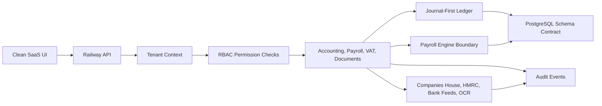

# Phase 1 Foundation

This phase turns AccountHub/NexoryRole from a working MVP into a product with a production contract. The current Railway service remains usable, while the architecture now defines how real persistence, tenancy, security and compliance should work.

## Architecture



## What Is Live Now

- Clean fintech UI remains served by Railway.
- Payroll employer file, employee starter records, pay detail grids and statutory document actions are live demo workflows.
- Journal validation and posting boundary are exposed through API endpoints.
- Tenant context is accepted through `x-tenant-id`, defaulting to `practice_demo`.
- Audit events are created for client, employer, employee, statutory document, document and journal actions.
- HMRC and Companies House live calls remain gated until credentials are configured.

## Phase 1 API Contracts

```text
GET  /api/platform/foundation
GET  /api/platform/security-posture
GET  /api/platform/database-contract
GET  /api/platform/roadmap
GET  /api/tenant-boundary/validate
GET  /api/audit-events
POST /api/audit-events
POST /api/ledger/journals/post
GET  /api/companies-house/readiness
GET  /api/companies-house/search?q=...
GET  /api/companies-house/company/:companyNumber
```

## PostgreSQL Boundary

The migration contract is in:

```text
backend/database/phase1_foundation.sql
```

It defines practices, users, memberships, business entities, payroll settings, employees, starter forms, payroll runs, payslips, chart accounts, journal entries, journal lines, sales invoices, purchase bills, bank lines, VAT periods, statutory documents, integration connections and audit events.

## Security Position

The product is not yet ready for live payroll filing or live HMRC submission. Before that:

- Replace in-memory writes with PostgreSQL repositories.
- Store sensitive payroll and tax identifiers using field-level encryption.
- Enforce RBAC on every write route.
- Enable PostgreSQL row-level security with a per-request practice context.
- Add automated payroll fixture tests for each supported UK tax year.
- Complete HMRC OAuth, fraud-prevention header validation and certification work.

## Next Phase

Phase 2 should move writes into PostgreSQL:

1. Create a repository layer around `DATABASE_URL`.
2. Run `phase1_foundation.sql` as the first migration.
3. Seed a demo practice, entity, employer, employee, CoA and payroll run.
4. Persist audit events and documents.
5. Convert client, employer, employee and journal write endpoints first.
